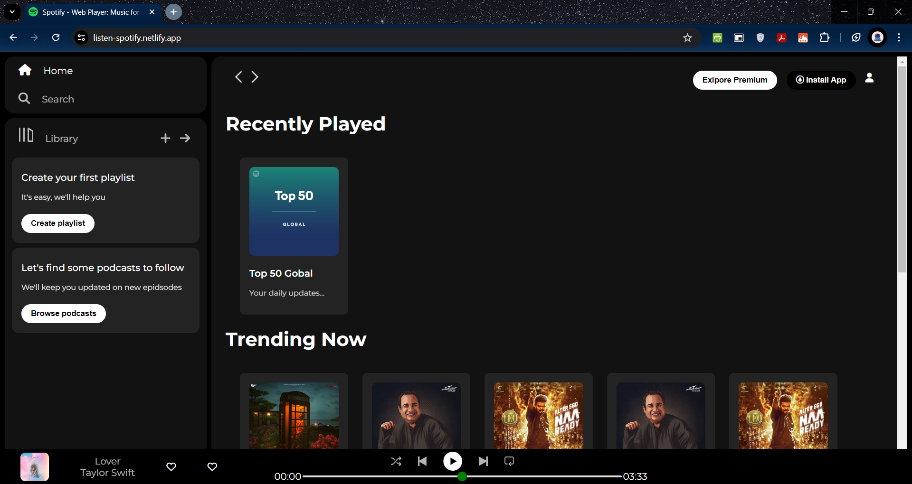

  

    <h1 align="center">Spotify</h1>

    <em><code><a href="https://listen-spotify.netlify.app/" target="_blank" >❯ Live</a></code></em>

This repository contains a clone of the popular music streaming service Spotify. It replicates the core functionalities and user interface of Spotify, allowing users to browse music, create playlists, and enjoy their favorite tracks.

### Features
- **User Authentication**: Users can sign up, log in, and log out securely.
- **Browse Music**: Explore a vast catalog of artists, albums, and tracks.
- **Search Functionality**: Find specific songs, albums, or artists quickly.
- **Create and Manage Playlists**: Users can create custom playlists, add or remove tracks, and reorder songs.
- **Music Player**: Play, pause, skip tracks, and control volume directly from the interface.
- **Responsive Design**: The website is designed to work seamlessly across desktop, tablet, and mobile devices.

### Technologies Used

- **Frontend**: HTML, CSS (Bootstrap), JavaScript (React)
- **Backend**: Node.js, Express.js, MongoDB
- **Authentication**: JSON Web Tokens (JWT)
- **Database**: MongoDB (using Mongoose for object modeling)
- **API Integration**: Spotify Web API for fetching music data

### Acknowledgments

This project was created as a learning exercise inspired by Spotify. Special thanks to the Spotify Web API for providing access to music data.

### Screenshots

### Contact

For any questions or feedback regarding this project, feel free to reach out to me at rajatrathi029@gmail.com
